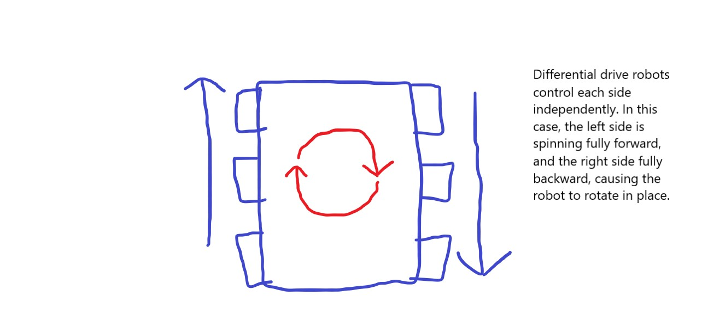

# TANK DRIVE

Welcome back! Or not. I don't know, I mean I don't wanna assume anything, you know.

Whatever, moving on, let's program Palpatine! Palpatine is a robot we have for practicing code on. It's a differential drive robot, which means two sides are controlled independent of each other. Basically, there's a left side, and a right side, and we pass different values to each side. Wow, you just learned a thing! Or didn't, if you already knew that. If you did, gold star for you! If you didn't, well, better luck next time.

This guide for programming tank drive will go very slowly, so feel free to skip through it if you feel you already have a good grasp on this.



Before we program this robot, let's go over tank drive.

## TANK DRIVE

Tank drive is an incredibly simple way to code a differential drive robot. All you do is take how far forward or backward the joysticks of your controller are, and then pass those to the motor, sort of like, you guessed it, a tank. Gold star for you! With a left and right joystick, you just have to pass the left joystick value to the left motors, and the right joystick value to the right motors.

## NOW THAT WAS SIMPLE!

It was, disembodied header! Boy, I sure do hope programming it is just as simple!

## SHUT UP

Wow, that's not very nice of you, dis-

## LEAVE ME ALONE

Is there something bothering you, disembodied header?

## YOU ARE BOTHERING ME

OK, dang, alright. Fair enough. Wow.

## PLEASE JUST GO BACK TO YOUR WEIRD PROGRAMMING GUIDE

Okie-dokie, disembodied headerokie!

Later in this guide, we'll go over frameworks you can use when programming a robot, but for now, let's just do things simple. Create a Python file, and name it whatever you want. It's usually best to name it `robot.py`, though, so just do that unless you feel like being a rebel.

## THIS GUIDE SUCKS >:(

Gonna ignore that.

First, import the `wpilib` and `ctre` modules. These will provide the basis for coding our robot. `ctre` for our motors, `wpilib` for basically everything else.

To begin, let's create a class for our robot. Name it whatever you want. I'll name mine `TankBot`. The first thing we need to do is make sure our robot inherits from the `wpilib.TimedRobot` class. This means the robot does everything every certain time interval, like every hundredth of a second, something like that. This class we're inheriting from is what makes our robot a robot. 

Next, we need to create a method to be called when the robot is initialized. Usually, we would use `__init__` for a class, but for programming robots, we will use the `robotInit` method. Please note that depending on the framework you're using, you may not even use this method. However, most of the time you'll use it to create your motors, and game controllers.

Inside your `robotInit` method, begin by creating the TalonFX motor controllers. These motor controllers, as the name implies, control motors (who thought that name up?). We use Falcon 500 motors that are controlled by TalonFX motor controllers. I'm not very experienced with the electronics of the robot, so as a very simple explanation, these motor controllers are plugged into our roboRIO, so we can access them in our code. Each motor controller has a specific number assigned to it that we need to use when creating them. To create TalonFX controllers, use the `ctre.TalonFX` or `ctre.WPI_TalonFX` class with the number of the TalonFX. Here's what we've got so far:

```python
import wpilib
import ctre

class TankBot(wpilib.TimedRobot):

    def robotInit(self):

        self.FLMotor = ctre.TalonFX(0)
        self.BLMotor = ctre.TalonFX(1)
        self.FRMotor = ctre.TalonFX(2)
        self.BRMotor = ctre.TalonFX(3)
```

When we do tank drive, it's typically a good idea to set the back motors to follow what the front motor output is. Basically, when we give values to the front motors, their corresponding back motors will take those values. To achieve this, use the `follow` method of the TalonFXs.

```python
self.BLMotor.follow(self.FLMotor)
self.BRMotor.follow(self.FRMotor)
```

Next, let's set the neutral mode of the motors. The neutral mode is what the motors will do when they don't spin. We want them to brake, so use the `setNeutralMode` method for each motor, passing `ctre.NeutralMode.Brake` for each method.

```python
self.FLMotor.setNeutralMode(ctre.NeutralMode.Brake)
self.BLMotor.setNeutralMode(ctre.NeutralMode.Brake)
self.FRMotor.setNeutralMode(ctre.NeutralMode.Brake)
self.BRMotor.setNeutralMode(ctre.NeutralMode.Brake)
```

Finally, we'll just add an Xbox controller so we can control the robot. Here's where we need to make a distinction between the ports we use for things connected to the computer, and the device numbers for the motors. These are two different things. There may be a device connected to port 0 as well as a motor controller with a device number of 0. 

## They are not the same object!

Thanks, disembodied header. Anyway, to create the Xbox controller, use the `wpilib.XboxController` class and pass the port to use for it. Let's use port 0.

```
self.driverController = wpilib.XboxController(0)
```

We're finally done initializing the robot! Here's what your code should look like, more or less:

```
import wpilib
import ctre

class TankBot(wpilib.TimedRobot):

    def robotInit(self):

        self.FLMotor = ctre.TalonFX(0)
        self.BLMotor = ctre.TalonFX(1)
        self.FRMotor = ctre.TalonFX(2)
        self.BRMotor = ctre.TalonFX(3)

        self.BLMotor.follow(self.FLMotor)
        self.BRMotor.follow(self.FRMotor)

        self.FLMotor.setNeutralMode(ctre.NeutralMode.Brake)
        self.BLMotor.setNeutralMode(ctre.NeutralMode.Brake)
        self.FRMotor.setNeutralMode(ctre.NeutralMode.Brake)
        self.BRMotor.setNeutralMode(ctre.NeutralMode.Brake)

        self.driverController = wpilib.XboxController(0)
```

There are two main modes robots exist in during competition, as you've probably learned by now: autonomous, where the robots do stuff by themselves, and teleop, where you control the robot. We need to code a teleop function. Each mode has an `init` and `periodic` function to go with it. Let's code a `teleopPeriodic` method.

In our `teleopPeriodic` method, we need to get values from our Xbox controller, and set the motor controllers to those values.

To get values from the joysticks, which we'll use to drive the robot, we can use the Xbox controller's `getLeftY`, and `getRightY` methods, to get how far forward or backward the joysticks are. 

TalonFXs have different control modes. These include PercentOutput, MotionMagic, and even MusicTone for some reason. We need to use PercentOutput to drive in teleoperated mode. Then, we set the value to any float between -1.0 and 1.0, which is brilliant because the joysticks on the Xbox controller go from -1.0 to 1.0! So to set the motors, we can do this.

```python
def teleopPeriodic(self):

        self.FLMotor.set(ctre.ControlMode.PercentOutput, self.driverController.getLeftY())
        self.FRMotor.set(ctre.ControlMode.PercentOutput, self.driverController.getRightY())
```

However, there's an issue. The y values on the driver controller are negative when the joysticks are pushed forward. However, to make the motor go forward, we need the values to be positive. This is easy enough to fix, though, we just have to multiply the values we're giving to the motors by -1.

In the end, this is our final teleopPeriodic code:

```python
def teleopPeriodic(self):

    self.FLMotor.set(ctre.ControlMode.PercentOutput, -self.driverController.getLeftY())
    self.FRMotor.set(ctre.ControlMode.PercentOutput, -self.driverController.getRightY())

```

The last thing we have to do is run the robot. To do that, at the end of your robot file, include this statement:

```python
if __name__ == "__main__":
    wpilib.run(TankBot)
```

This checks whether we are running the file directly or not. If we're importing the file somewhere else, this will not work. If we are running the file directly, we tell wpilib to run the robot class.

Here's everything put together:

```python
import wpilib
import ctre

class TankBot(wpilib.TimedRobot):

    def robotInit(self):

        self.FLMotor = ctre.TalonFX(0)
        self.BLMotor = ctre.TalonFX(1)
        self.FRMotor = ctre.TalonFX(2)
        self.BRMotor = ctre.TalonFX(3)

        self.BLMotor.follow(self.FLMotor)
        self.BRMotor.follow(self.FRMotor)

        self.FLMotor.setNeutralMode(ctre.NeutralMode.Brake)
        self.BLMotor.setNeutralMode(ctre.NeutralMode.Brake)
        self.FRMotor.setNeutralMode(ctre.NeutralMode.Brake)
        self.BRMotor.setNeutralMode(ctre.NeutralMode.Brake)

        self.driverController = wpilib.XboxController(0)

    def teleopPeriodic(self):

        self.FLMotor.set(ctre.ControlMode.PercentOutput, -self.driverController.getLeftY())
        self.FRMotor.set(ctre.ControlMode.PercentOutput, -self.driverController.getRightY())

if __name__ == "__main__":
    wpilib.run(TankBot)
```