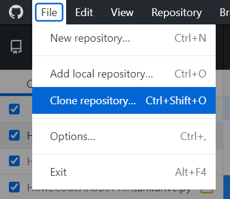
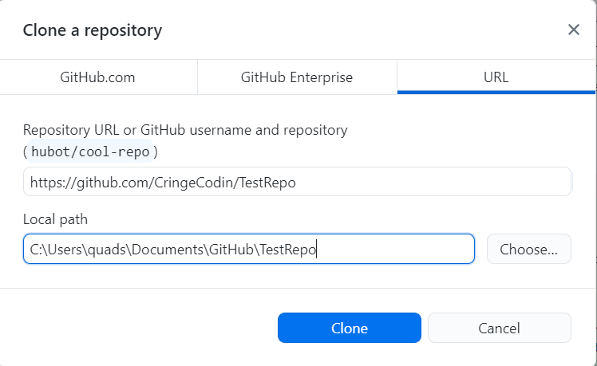
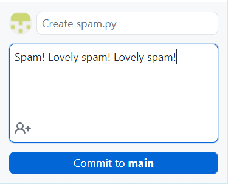
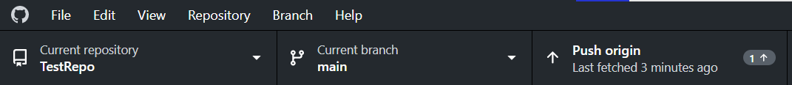
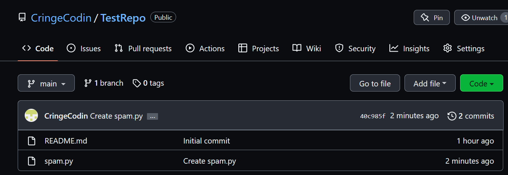
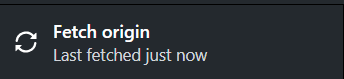
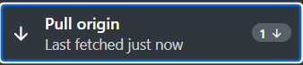

# GITHUB

Thanks for the introduction, disembodied header!

## I ONLY WORK SO I CAN PAY FOR MY CHILDREN'S EDUCATION

You have children?

## YES

Okie dokie! Let's get to work on GitHub!

# BUT FIRST, GIT

No.

## DO IT OR I QUIT

I can fire you whenever I want, disembodied header.

There's a lot of words we can use to describe Git. A distributed version control system. A three-letter-word. A folder, but on a bunch of different computers where anybody can edit it. Think of Git as a way to share files very easily between people. We can create a repository, or *repo* of files that anybody can clone and edit. Then, that anybody can push their version of the repository to the main, super cool one, and change the files. It's very cool. But in order to do anything in it, we have to do everything on the command-line, which is pretty boring.

If you don't have to use Git, don't use Git. Git walked so GitHub could run.

## AND NOW, GITHUB

GitHub is an online hosting site that hosts, well, Git repos. It makes using Git much easier, and it being on the Internet is pretty cool. Use it instead of Git. Please.

Provided you're using one of the laptops we have at Robotics, you should have GitHub installed, so don't worry about all that funny business with installing. You should be able to find files from GitHub in the Documents folder. You can edit them, delete them, create new ones, et cetera. **Or don't.**

## CLONING REPOSITORIES

Let's say Harald Hardrada is back from the dead and hacking into my GitHub account, hypothetically. Wow! Who knew he was so good at coding! Why, he just programmed an entire robot, and made a repository for it. Too bad I don't have that repo on my computer.

**OH WAIT, I CAN!!!**

To clone a repository, you'll need the URL for it. Let's say Harald Hardrada's repo is called "TestRepo". The URL should be, provided he made it when he hacked into my account, [https://github.com/CringeCodin/TestRepo.](https://github.com/CringeCodin/TestRepo)

Obviously you don't need to do 4-dimensional math to find the URL, you can just head to anybody's profile to view their repositories. Either way, once you have the URL, enter the GitHub Desktop application, and go to File (at the top) > Clone repository

Next, go to URL, paste the link of the repository you want to clone into the Repository URL box, and then specify a path for the repo. By default it'll be saved in the GitHub folder in Documents, but you can change that.

## PUSHING COMMITS

Think of a commit as a specific version of your repo, like a photograph. A memory. Pepperidge Farms remembers all your commits...

## SNAP OUT OF IT MAN

Right, yeah, so let's say you added a file in TestRepo, and you want everybody's repository to reflect that change. We need to push your commit to the repo. First, we need to actually create the commit. To do this, go to the GitHub Desktop application. You should see in the bottom left corner a little box that you can enter text into and also a big nice *commit* button. By default, the text should say *Create yourfile.py*, because that's what you did. However, you can change that to be whatever you want. You can also add a description to get more detailed about what you did. Then, you'll just hit *Commit* and you'll have a commit created!

However, we still need to push our file. To do this, navigate to the top of the screen where you'll see a little button that says *Push origin*. Just hit that.

If you look at the repository online, you should see your changes!

By the way, you've probably noticed the *to main* I conveniently ignored up there. *main* is the main branch in the repo. You can create many different branches that can then be merged. Don't worry about that for now, though.

## PULLING COMMITS

Let's say Harald Hardrada didn't like that your code referenced a Monty Python sketch that makes fun of Vikings, and changed it so it instead makes fun of airplane food. Now let's say that you, to extend a hand of peace, want to pull the commit he's pushed to the repository. Let's go over pulling commits.

To pull a commit, go into the GitHub Desktop application (I know I sound like a broken record, but I don't care that much), and fetch the origin of the repo. It should be in the same place the *Push origin* button was.

In its place, the *Pull origin* button should appear. Click it, and the new changes will save to your computer.

## CONCLUSION

That's about everything you need to know about GitHub. Next, we'll go over different frameworks you can use when programming a robot.